# 腾讯客户端菁英班结课作业

## 一、产品简介

**产品名称**：基于端云一体化的运动记录平台

**运行环境**：Harmony OS

**完成时间**：2024年11月

**相关链接**：[安装包](https://cni.lanzouw.com/iwGNK2ghzuij) [演示视频](https://cni.lanzouw.com/iDEDj2ghzy7c)

## 二、总体功能概述

​	基于端云一体化的运动记录平台（后简称“平台”）是基于HarmonyOS生态系统开发的专业运动记录应用，采用华为端云一体化架构，为用户提供高精度的运动轨迹记录和数据管理服务。系统通过HMS Core位置服务和高德地图开放平台实现精确的轨迹追踪，支持跑步、骑车、健走、游泳等多种运动类型。平台深度整合AGConnect云服务，实现运动数据和轨迹图像的云端存储与多端同步，并采用华为分布式软总线技术，支持设备间的无缝协同。在用户界面层面，系统基于ArkUI框架开发，采用ArkTS声明式UI技术，打造了简洁直观的操作体验。通过严格的身份认证机制和数据加密传输，平台确保了用户数据的安全性和私密性。本平台致力于为用户提供专业、可靠的运动管理服务，帮助用户实现科学运动的数字化记录。

## 三、整体系统架构

​	本平台采用基于HarmonyOS的分层架构设计，整体分为表现层、业务逻辑层和数据层三个主要层次（软件架构图如下所示）。表现层采用ArkUI框架实现用户界面，业务逻辑层处理核心运动数据计算和状态管理，数据层负责与AGConnect云服务交互实现数据持久化。系统通过分布式软总线技术实现设备间的数据传输，保证了多端数据访问的一致性。

​	平台的核心功能模块采用组件化设计思路，将运动记录、数据管理、用户认证等功能解耦为独立的服务模块。每个模块都定义了清晰的接口规范，通过依赖注入的方式实现模块间的交互，提高了系统的可维护性和扩展性。系统还集成了HMS Core位置服务和高德地图API，为运动轨迹记录提供了可靠的技术支持。

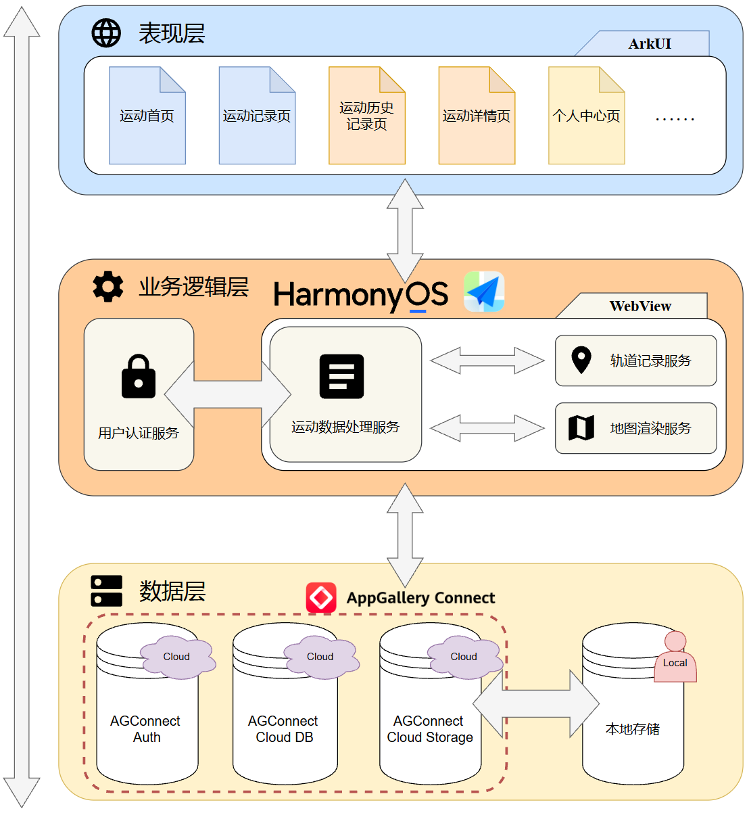

## 四、程序开发与运行环境

- ### 开发环境

  - **开发环境配置**

    |   类型   |        配置项         |             说明              |
    | :------: | :-------------------: | :---------------------------: |
    |   IDE    | DevEco  Studio 5.0.0  |     HarmonyOS集成开发环境     |
    |   SDK    | HarmonyOS  SDK API 12 |    HarmonyOS系统开发工具包    |
    | 编程语言 |         ArkTS         | HarmonyOS应用开发官方高级语言 |

  - **基础服务配置**

    |   类型   |         配置项         |           说明           |
    | :------: | :--------------------: | :----------------------: |
    |  云服务  |    AGConnect  Core     |    端云一体化系统架构    |
    | 地图服务 | 高德地图JavaScript API | 端设备地图与运动轨迹渲染 |
    | 定位服务 |   HMS  Location Kit    |  端设备GPS位置信息采集   |

  - **相关依赖配置**

    |   类型   |          配置项          |    说明     |
    | :------: | :----------------------: | :---------: |
    |  云服务  |    @hw-agconnect/auth    |  用户认证   |
    |  云服务  |   @hw-agconnect/cloud    | 云存储服务  |
    | 系统服务 |    @ohos.promptAction    |  界面提示   |
    | 系统服务 |       @ohos.router       |  页面路由   |
    | 系统服务 |    @ohos.web.webview     | WebView组件 |
    | 系统服务 | @ohos.geoLocationManager |  位置服务   |
  
- ### 运行环境

  - **运行环境配置**

    |   类型   |       最低要求       |       推荐配置        |
    | :------: | :------------------: | :-------------------: |
    | 系统版本 |   HarmonyOS  3.0.0   |   HarmonyOS  5.0.0    |
    |   SDK    | HarmonyOS  SDK API 9 | HarmonyOS  SDK API 12 |
    | 存储空间 |    100MB可用空间     |   200MB以上可用空间   |
    | 网络要求 |    移动数据/WiFi     |     移动数据/WiFi     |

  - **运行权限要求**

    |   权限   |         权限代码         |          说明          |
    | :------: | :----------------------: | :--------------------: |
    | 位置信息 | ohos.permission.LOCATION | 用于地图与运动轨迹获取 |
    | 网络访问 | ohos.permission.INTERNET | 用于数据同步和地图加载 |

## 五、技术亮点与实现原理

- ### 基于WebView的运动轨迹系统

  - **Web组件轨迹渲染方案**

    本平台创新性地采用WebView与原生混合开发模式实现轨迹记录系统。通过web_webview组件将高德地图JavaScript API封装为原生组件，实现了高性能的轨迹渲染（如下图所示）。系统通过注入JavaScript接口实现原生代码与地图组件的双向通信，动态更新轨迹显示。这种架构既保留了高德地图强大的可视化能力，又通过原生化封装提升了性能表现，为用户提供流畅的轨迹记录体验。

    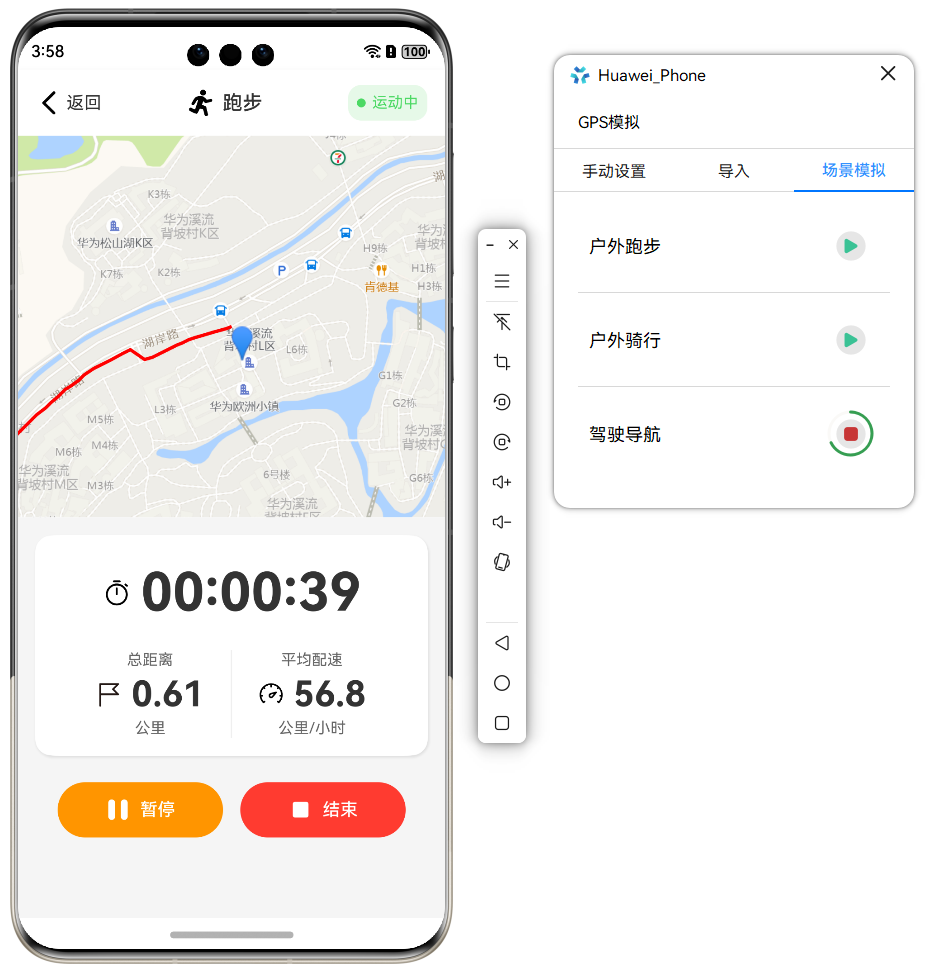

  - **轨迹数据采集与处理机制**

    系统基于HMS Core位置服务实现精确的GPS定位，通过geoLocationManager模块获取实时位置信息。平台采用1秒间隔的定位策略，在保证轨迹精度的同时优化了设备能耗。位置数据通过球面距离计算公式实时计算累计距离，同时结合运动时间实现实时配速的动态更新。系统支持运动轨迹的暂停、继续和结束等状态管理，确保轨迹数据的完整性和准确性。

  - **轨迹可视化与快照机制**

    地图组件支持轨迹的实时绘制和动态更新，系统通过JavaScript实时渲染运动轨迹，为用户提供直观的视觉反馈。此外，平台实现了创新的轨迹快照生成机制。系统在运动结束时，通过WebView的截图能力自动生成轨迹快照图像，记录完整的运动路径（如下图所示）。在查看运动历史记录时，相比WebView的实时渲染，快照机制能高效快捷地展示静态运动轨迹，优化程序性能，提升用户体验。

    | 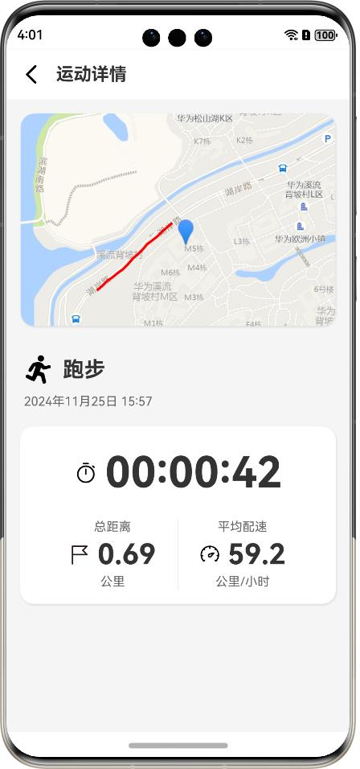 | 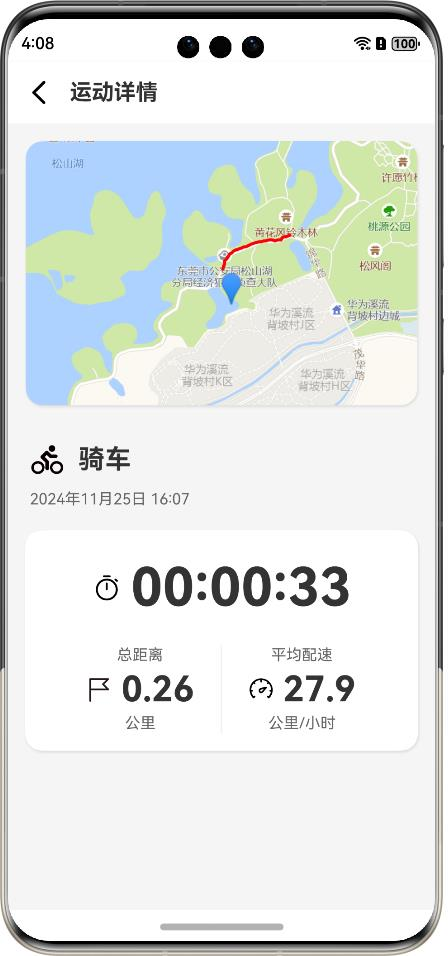 |
    | :--------------------: | :--------------------: |

    

- **基于端云一体化的系统架构设计**

  - **AGConnect云服务集成**

    平台深度整合华为AGConnect云服务，构建了完整的端云协同机制。系统通过Cloud Storage服务实现轨迹快照的云端存储，确保图像资源的永久保存。运动记录的结构化数据通过Cloud DB进行同步，支持数据的持久化存储和多端访问。平台实现了基于Token的身份认证机制，确保数据访问的安全性。

    在查看运动历史记录时，系统通过Cloud DB获取运动记录的详细数据并渲染到UI。其中，对于运动时间、总距离和平均配速等结构化数据，通过字段值直接渲染；而对于快照图像等二进制文件，则先通过字段值获取远程访问的URL，再通过该URL加载并渲染对应数据。端云一体化系统工作流程如下图所示：

    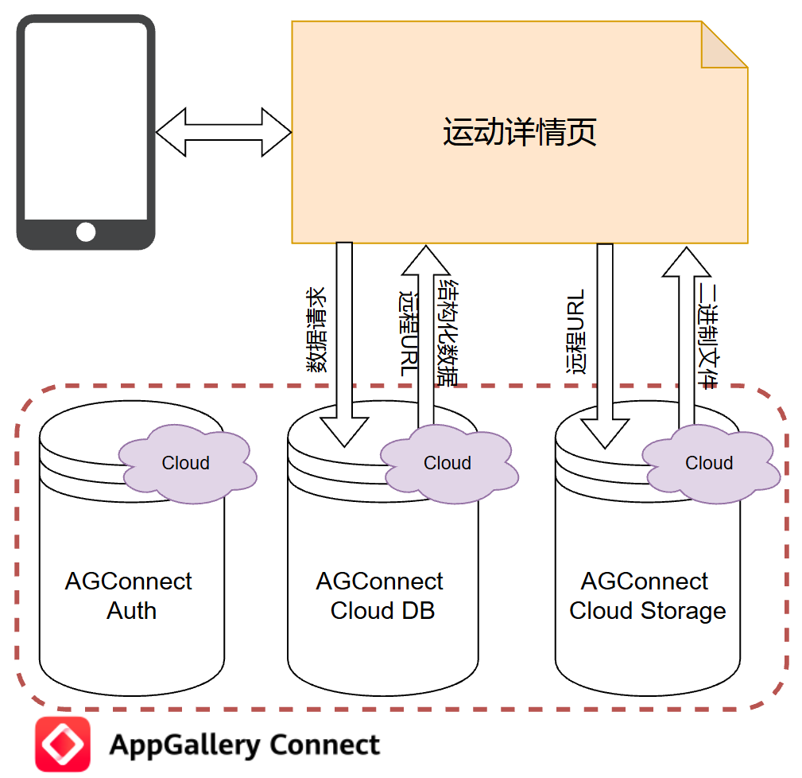

  - **AGConnect云认证机制**

    平台实现了严格的数据安全保护机制。通过AGConnect Auth服务进行用户认证，采用手机号码和验证码的双重验证确保账号安全。系统实现了基于Token的访问控制，确保用户只能访问自己的运动数据。此外，平台通过加密传输确保数据传输的安全性。

- **基于HarmonyOS和ArkTS的用户界面**

  - **ArkTS声明式UI**

    平台采用HarmonyOS最新的ArkTS语言进行开发，实现了声明式的UI构建。通过@Component装饰器定义功能组件，使用@State实现组件状态管理，构建了响应式的用户界面。系统采用组件化的开发方式，提高了代码的复用性和维护性。

  - **界面组件设计**

    平台实现了一系列自定义组件，包括运动类型卡片、记录列表项、自定义对话框等。通过ArkTS的状态管理机制，实现了组件的动态更新和交互响应。系统使用Tabs组件实现主页面的切换，通过自定义的TabBuilder实现了统一的视觉风格。

  - **交互体验优化**

    系统实现了流畅的页面转场效果和状态切换动画。通过精心设计的视觉反馈，为用户操作提供及时的响应，优化用户体验。平台支持下拉刷新、列表滚动等常用交互功能，并通过合理的布局设计提升了界面的可用性。运动记录过程中，系统通过实时更新的数据显示和地图轨迹，为用户提供直观的运动状态反馈。

## 六、产品界面展示

- ### 登录页面

  | 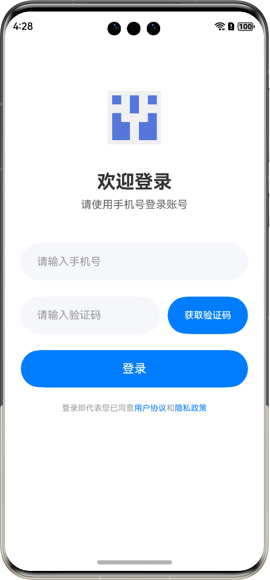 | 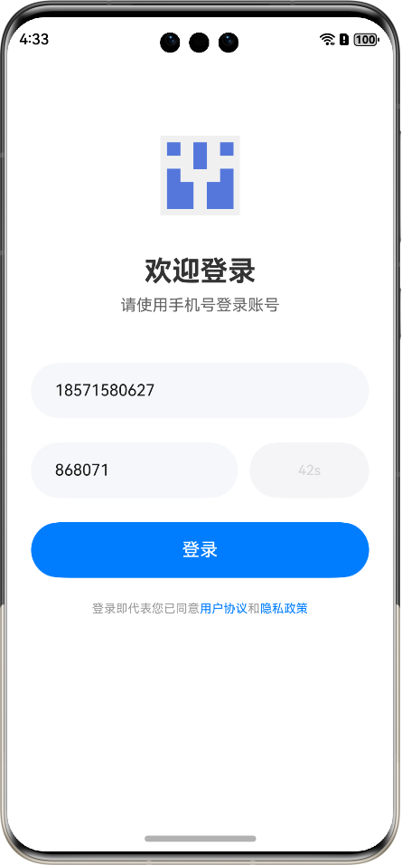 |
  | :-------------------------: | :-------------------------: |

  

- ### 运动记录页面

  | 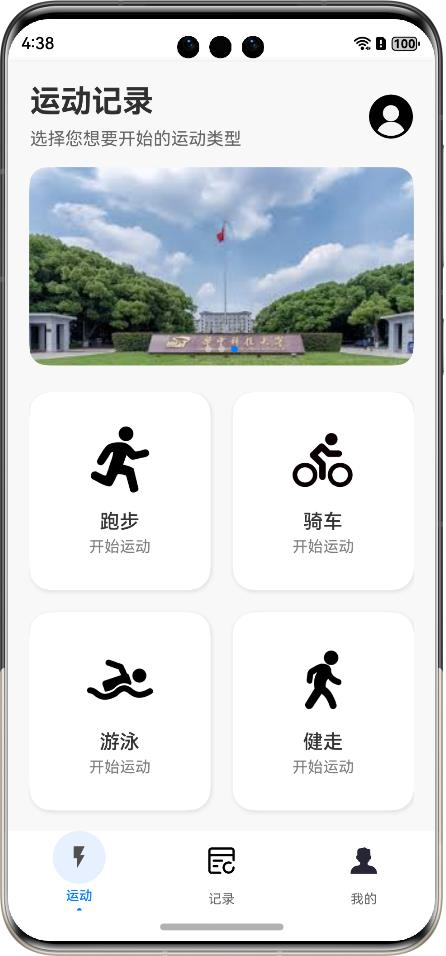 |  |
  | :---------------------------: | :---------------------------: |
  |  |  |

  

- ### 运动历史记录页面

  | 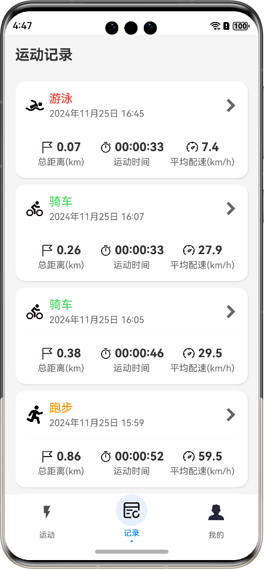 | 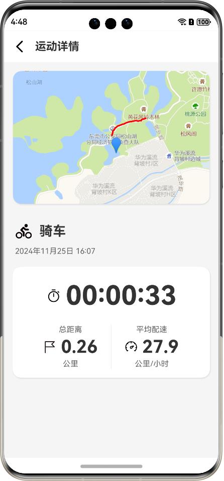 |
  | :--------------------------: | :--------------------------: |

  

- ### 个人中心页面

  | 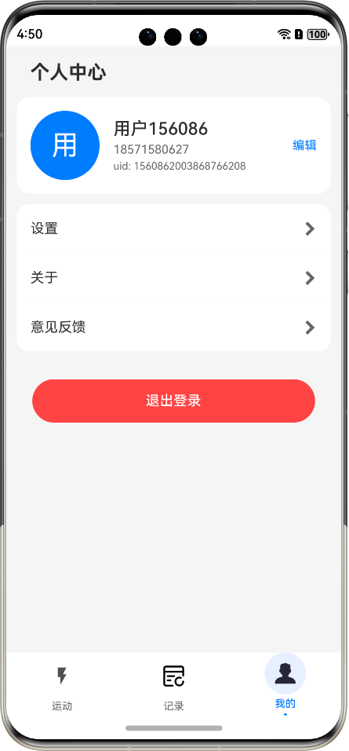 | 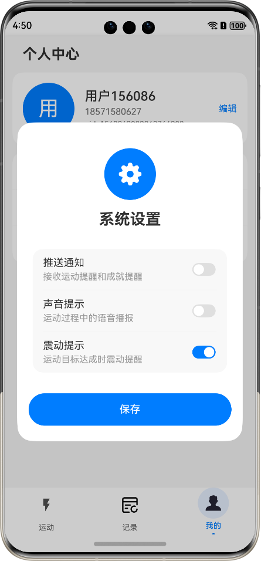 |
  | :---------------------------: | :---------------------------: |
  | 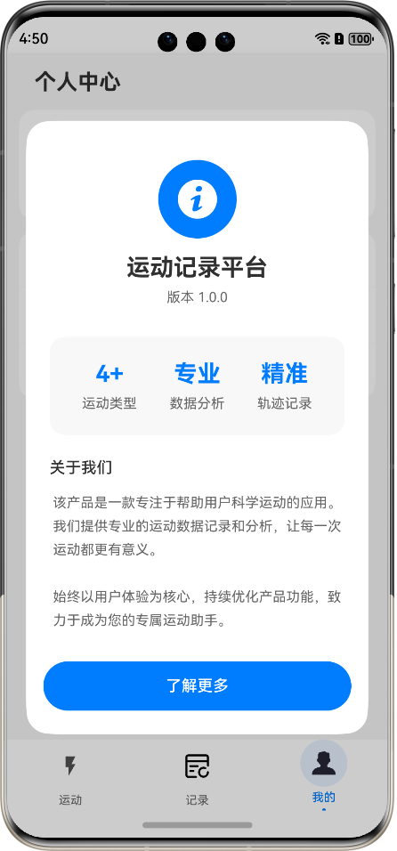 |  |

  

